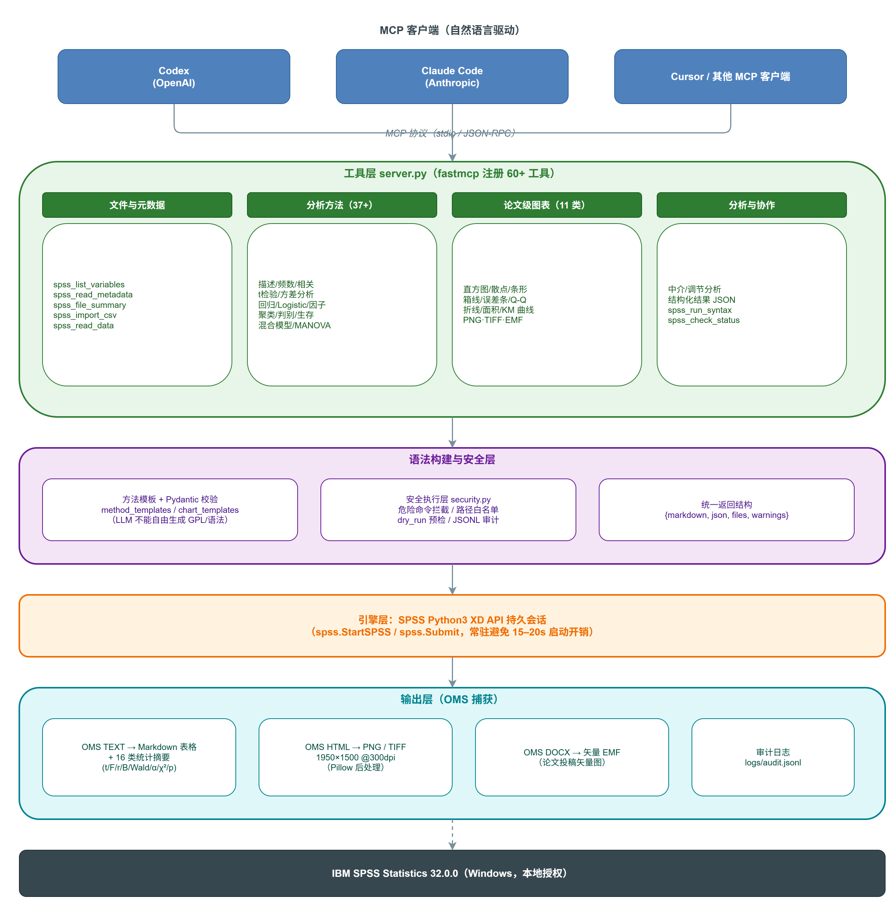
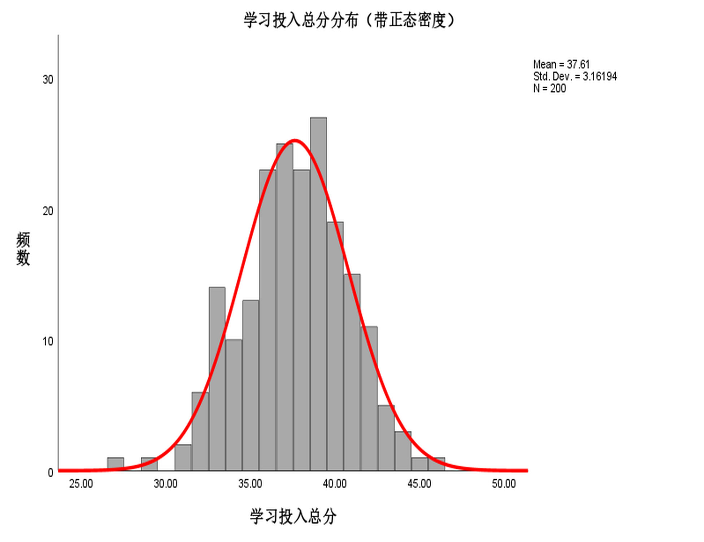
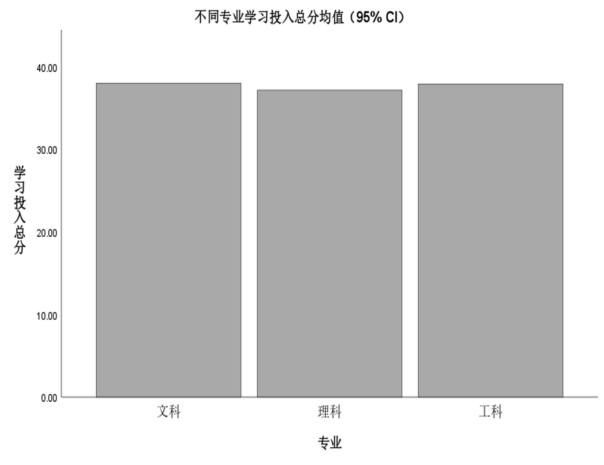
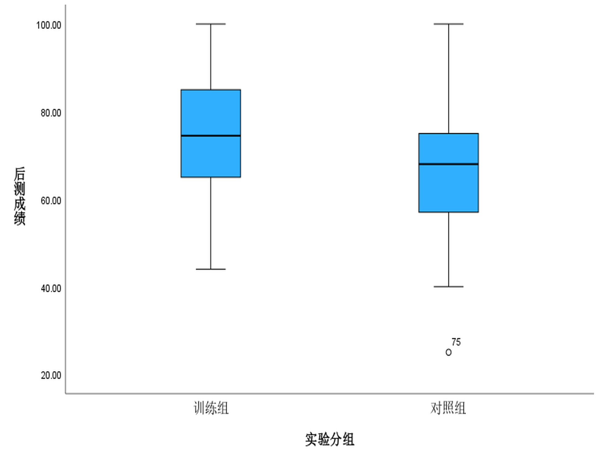
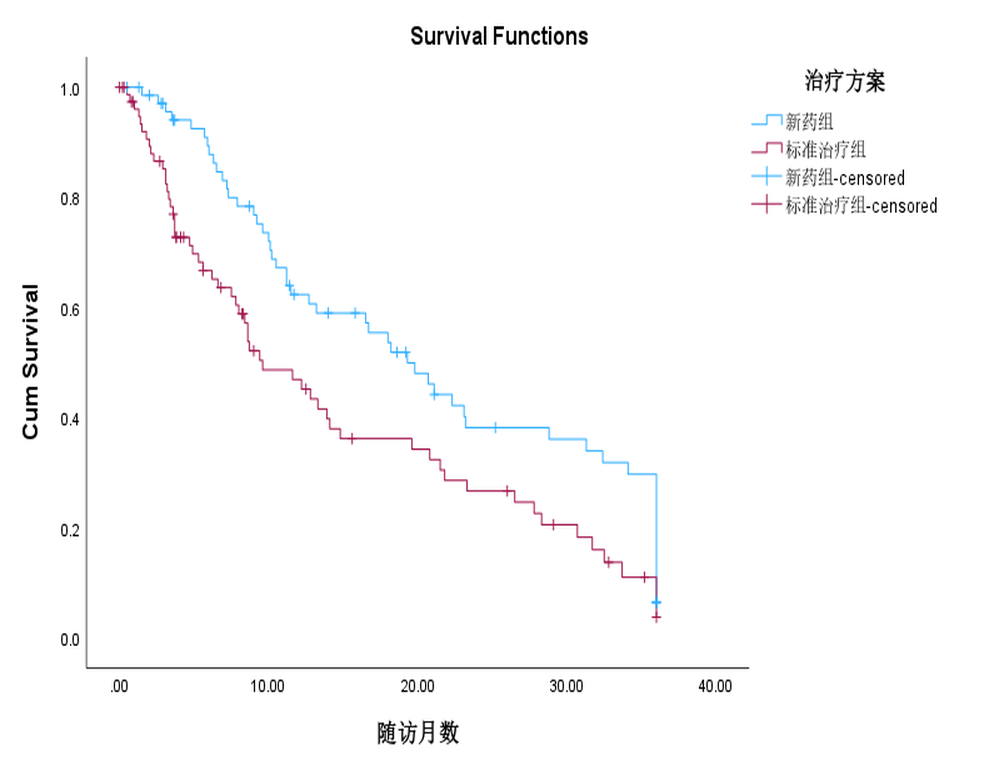
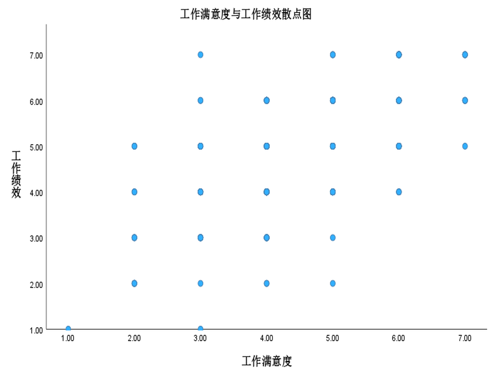

# SPSS Studio MCP

> 让 SPSS 成为 Agent 的「统计引擎 + 制图工厂」：论文级图片、深度结果解析、方法真机验证、安全执行。

**简体中文** ｜ [English](README.en.md)

[](LICENSE)
[]()
[]()

`spss-studio-mcp` 是一个面向 **IBM SPSS Statistics** 的 MCP（Model Context
Protocol）服务器，为 Codex / Claude Code / Cursor 等 Agent 客户端提供：

- **论文级出图**：11 类 `spss_chart_*` 工具，一键导出 PNG / TIFF / EMF（1950×1500 @300 dpi），路径回传可直接投稿；
- **深度结果解析**：OMS 文本 → Markdown 表格 + 结构化 JSON + 16 类分析统计摘要（t / F / r / B / Wald / α / χ² / p / 效应量）；
- **方法真机验证**：37 个分析方法 + 11 个补充工具全部在真实 SPSS 32 验收通过；
- **中介 / 调节**：`spss_mediation`（Baron & Kenny 三步回归 + Sobel）、`spss_moderation`（中心化交互回归）；
- **安全执行层**：危险命令拦截、数据路径白名单、`dry_run` 预检、JSONL 审计日志。

全部能力已在 **IBM SPSS Statistics 32.0.0（Windows）** 真机验证（109 个单元测试全部通过）。

---

## 系统架构



```text
MCP 客户端（Codex / Claude Code / Cursor）
        │  MCP 协议（stdio）
        ▼
工具层    60+ 工具：文件/元数据 · 37+ 分析方法 · 11 类图表 · 中介/调节 · 结构化结果
        ▼
语法构建   方法模板 + Pydantic 校验 ｜ 安全层（危险拦截 / 白名单 / dry_run / 审计）
        ▼
引擎层    SPSS Python3 XD API 持久会话（spss.StartSPSS / spss.Submit）
        ▼
输出层    OMS TEXT→Markdown+JSON 摘要 ｜ OMS HTML→PNG/TIFF ｜ OMS DOCX→EMF
        ▼
IBM SPSS Statistics 32.0.0（Windows，本地授权）
```

架构源文件（draw.io 可编辑）：[docs/diagrams/architecture.drawio](docs/diagrams/architecture.drawio)

## 快速开始

```powershell
cd spss-studio-mcp
pip install -e ".[dev]"
spss-studio-mcp status                     # 应显示 SPSS batch: OK

spss-studio-mcp configure-codex            # 写入 Codex 客户端配置（~/.codex/config.toml）
spss-studio-mcp configure-claude           # 写入 Claude Code 配置（~/.claude.json）
```

然后在客户端里直接用自然语言驱动，例如：

```text
对 examples/data/survey_study.sav 做描述统计和可靠性分析
用 examples/data/experiment_study.sav 做独立样本 t 检验（group 分组，posttest）
用 examples/data/mediation_study.sav 做中介分析：autonomy → satisfaction → performance
画 examples/data/survey_study.sav 学习投入总分的直方图（带正态密度），PNG 300dpi
```

## 论文级图表（核心卖点）

| 工具 | 用途 |
|------|------|
| `spss_chart_histogram` / `spss_chart_histogram_density` | 分布直方图 / 直方图 + 正态密度 |
| `spss_chart_scatter` | 两变量散点图 |
| `spss_chart_bar` / `spss_chart_bar_error` | 分类均值条形 / 条形 + 95% CI 误差须 |
| `spss_chart_line` / `spss_chart_area` | 时间序列折线 / 面积图 |
| `spss_chart_boxplot` | 分组箱线图 |
| `spss_chart_errorbar` | 均值 ± CI 误差条 |
| `spss_chart_qqplot` | 正态 Q-Q 图 |
| `spss_chart_km_curve` | Kaplan-Meier 生存曲线 |

```python
spss_chart_histogram_density(
    variable="engagement_total",
    title="学习投入总分分布（带正态密度）",
    image_format="PNG",            # PNG / TIFF / EMF
    width_px=1950, height_px=1500, dpi=300,
    data_file="examples/data/survey_study.sav",
)
# → 返回图片文件路径，可直接投稿
```

样例输出（SPSS 32 真机导出，1950×1500 @300 dpi）：







## 结构化结果与统计摘要

```python
spss_structured_result(
    syntax="T-TEST GROUPS=group(1 2) /VARIABLES=posttest.",
    data_file="examples/data/experiment_study.sav",
)
# → {markdown, json: {tables, summary}, files, warnings}
```

`run_syntax` 返回的 Markdown 末尾自动附加 `### 统计摘要`（自然语言结论 + 关键统计量），
16 类分析的摘要抽取细节见 [docs/result_parsing.md](docs/result_parsing.md)。

## 样例数据

`examples/data/` 提供 5 组贴近论文场景的样例数据（固定随机种子，可复现）：

| 文件 | 场景 | 关键变量 |
|------|------|----------|
| `survey_study.sav` | 问卷：200 人学习投入 | `gender` / `major` / `q1`–`q12` / `engagement_total` |
| `experiment_study.sav` | 实验：120 人记忆训练前后测 | `group` / `pretest` / `posttest` / `gain` |
| `survival_study.sav` | 生存：150 例随访 | `treatment` / `time` / `status` |
| `mediation_study.sav` | 中介：300 员工 | `autonomy` / `satisfaction` / `performance` |
| `longitudinal_study.sav` / `long_study.sav` | 纵向：60 人 3 次测量 | `id` / `group` / `time` / `score` |

## 安全执行

- 危险命令（`HOST` / `ERASE` / `DELETE FILE` 等）行首匹配拦截；
- 数据文件路径白名单（`SPSS_ALLOWED_DIRS`，默认 `examples/` + 系统临时目录）；
- `spss_run_syntax(..., dry_run=True)` 先校验不执行；
- 审计日志默认写入 `logs/audit.jsonl`（可用 `SPSS_AUDIT_LOG` 改路径）。

详见 [docs/security.md](docs/security.md)。

## 文档

- [Agent 傻瓜式使用教程](docs/tutorial.md)：包含一键安装 Prompt、Codex/Claude Code 配置、论文分析场景和故障排查
- [技术报告（论文稿）](docs/technical_report.md)
- [出图管线 PoC 与 SPSS 32 兼容性发现](docs/poc_chart_pipeline.md)
- [结果解析（16 类分析摘要）](docs/result_parsing.md)
- [方法真机验证](docs/method_verification.md)
- [安全层](docs/security.md)
- [更新日志](CHANGELOG.md)

## 生态收录与发布

- 状态：P0–P4 里程碑完成，**v1.0.0 已发布**（[GitHub Releases](https://github.com/flupke91/spss-studio-mcp/releases)）；
- LobeHub / PulseMCP 收录条目与提交清单：[docs/ecosystem.md](docs/ecosystem.md)；
- Release v1.0.0 说明：[docs/release_notes_v1.0.md](docs/release_notes_v1.0.md)。

## 许可证

MIT（上游：`Exekiel179/SPSS-MCP`，MIT）。
